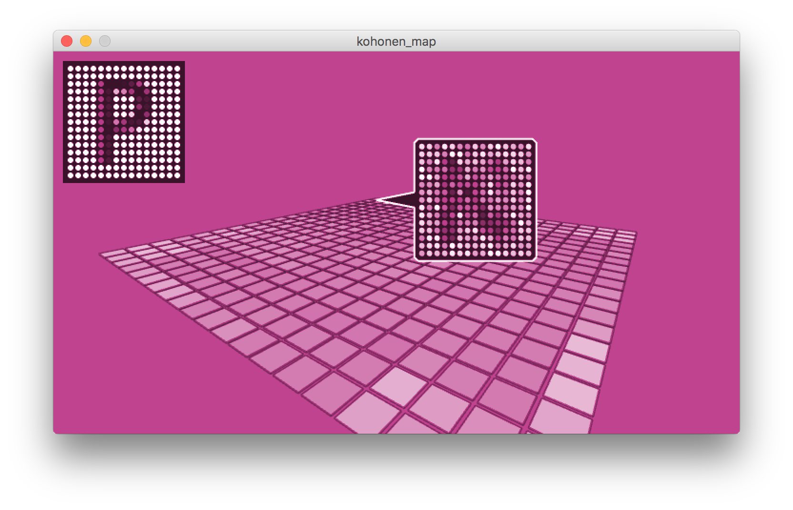
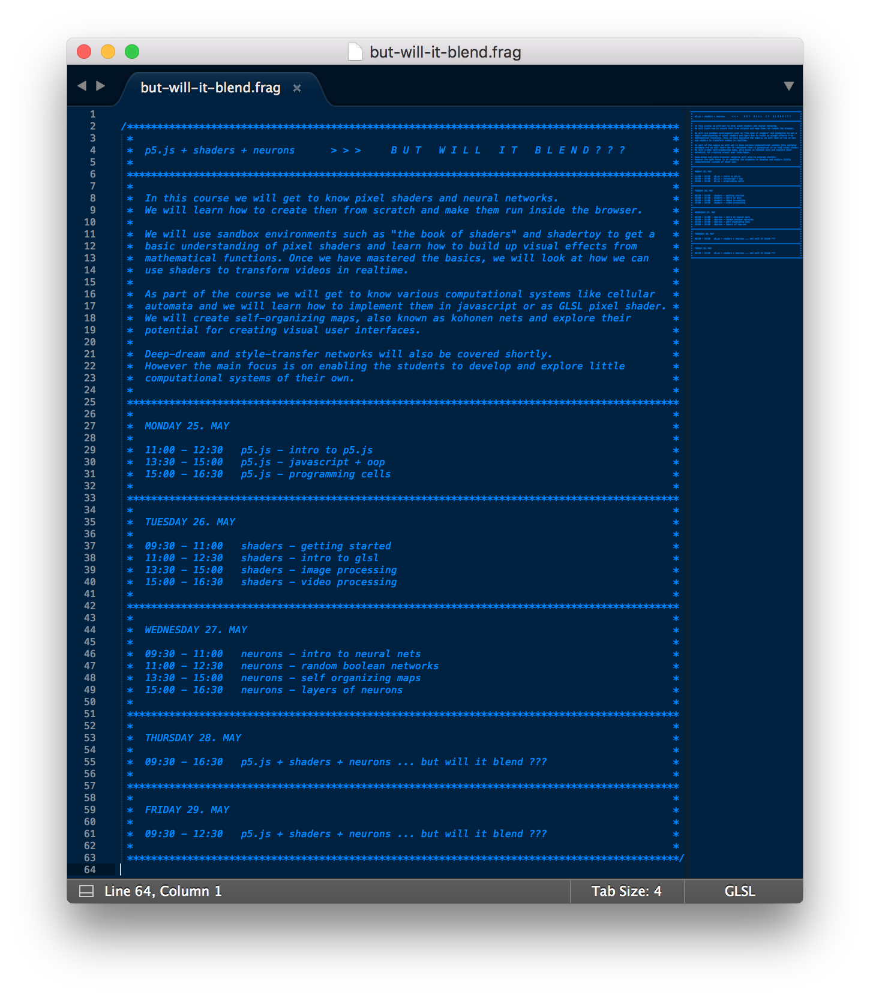
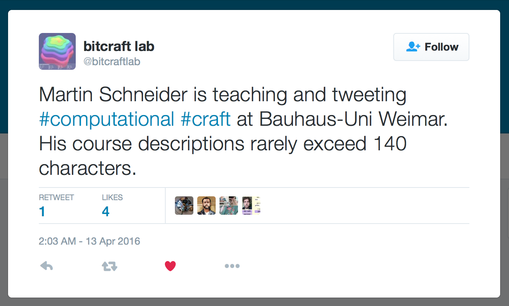

# ... but will it blend ???

*An introduction to p5.js + shaders + neural networks ...*

## p5.js + shaders + neurons

*Here's the schedule of the course. click it if you dare.*

## about

*My CV in a tweet ;-)*

## license

*All code in this repository is released under the [MIT License](LICENSE.md).*
