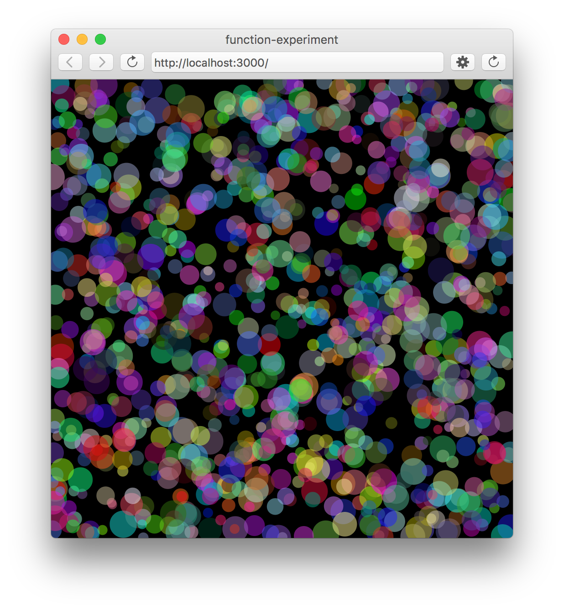

# ... but will it blend ???
## p5.js

**P5.js** is a javascript library + IDE, that is build around the processing idea.  
It provides a lot of stuff to get you started with programming in the browser.

### sections

* [getting started](bwib-1-1)
* [intro to p5.js](bwib-1-2)
* [javascript + oop](bwib-1-3)
* [programming cells](bwib-1-4)

### examples

#### Array Experiment ####

#### Function Experiment ####

#### Object Experiment ####

### links

* Download P5.js
* Online reference
* Game of Life Wiki
