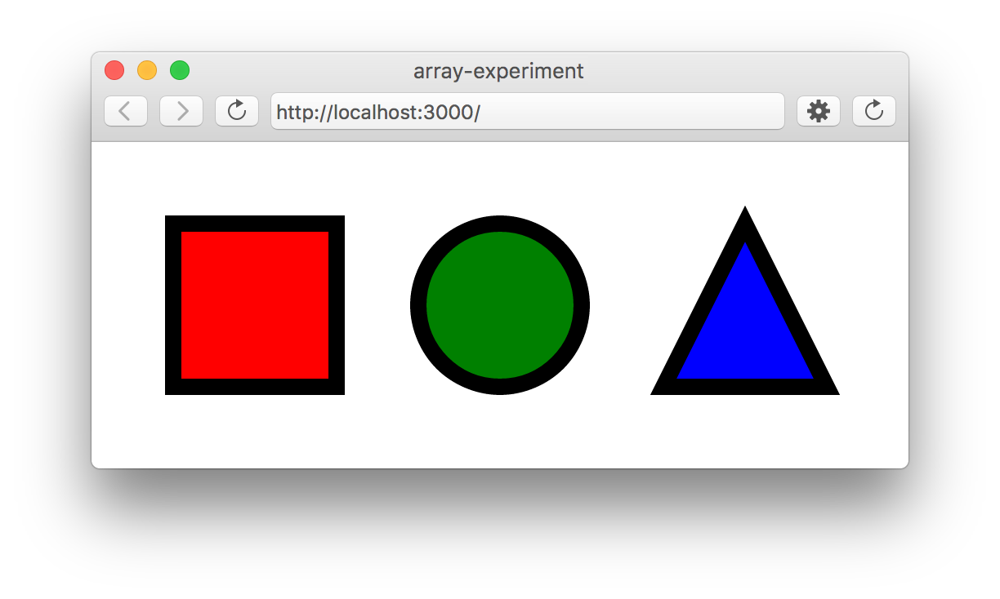
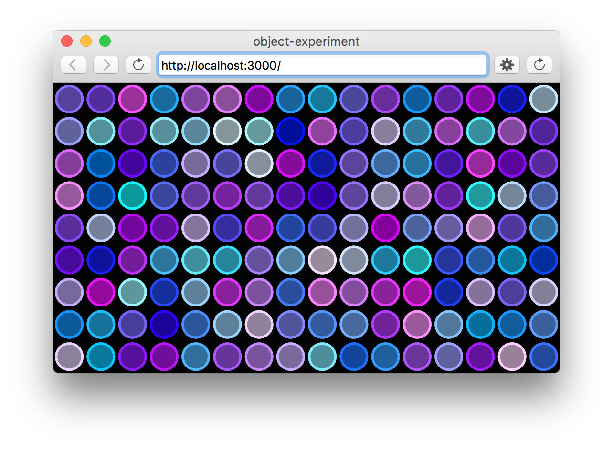
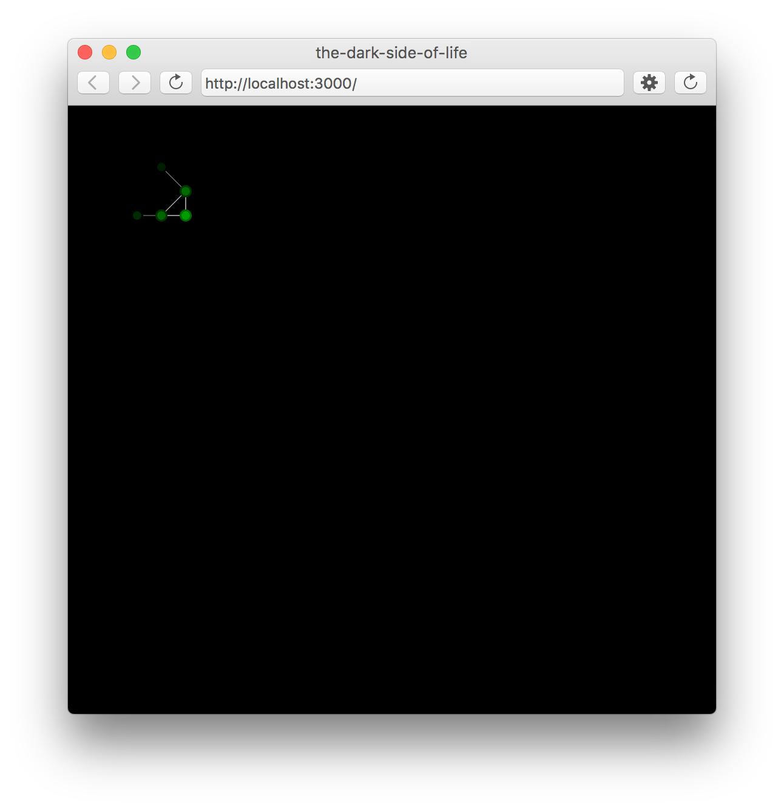

# ... but will it blend ???
## p5.js

**P5.js** is a javascript library + IDE, that is build around the processing idea.  
It provides a lot of stuff to get you started with programming in the browser.

### sections

* [getting started](bwib-1-1)
* [intro to p5.js](bwib-1-2)
* [javascript + oop](bwib-1-3)
* [programming cells](bwib-1-4)

### examples

#### Arrays, Objects, Functions ... ####

##### Array Experiment #####

*Experiment showing how to iterate over arrays, and use them to store colors, functions, etc.*

##### Object Experiment #####

*Experiment showing how to create objects that can draw themselves.*

##### Cell Experiment #####

*Experiment showing how to create cells. 
Note how they adjust their position and size when the window is changed*

#### Game of Life ####

##### Interactive Game of Life #####

Press `r` to reset, `c` to clear, and `SPACE` to pause.  
Use your mouse to draw new cells.  

##### The Dark Side of Life #####

Modifying the `draw()` and `drawConnections()` functions to create a different look.

Press `l` to toggle the lights.  
You can use the mouse to explore the structure.  

### links

* Download P5.js
* Online reference
* Game of Life Wiki
