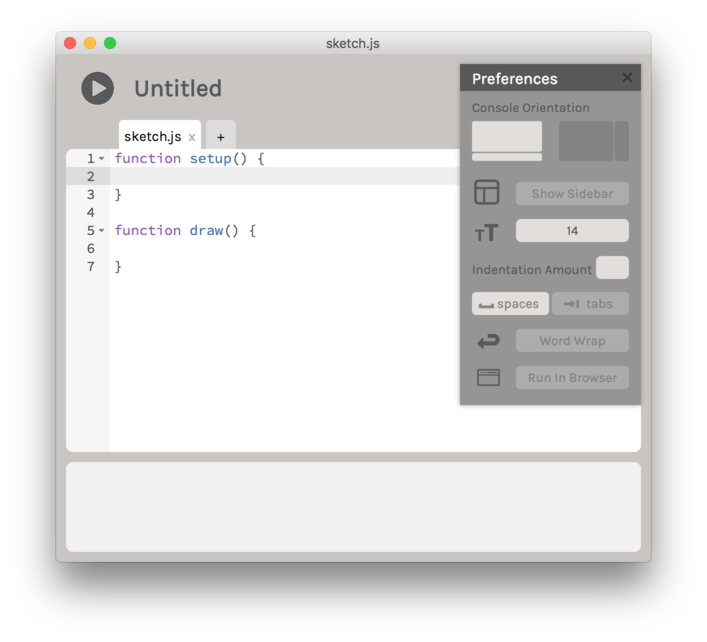

# ... but will it blend ???
## p5.js
### intro to p5.js

#### Things to remember

* **p5.js is a *javascript* library**. You can embed it in HTML documents.
* Don't mix it up with *processing.js* which is **dead**.  
  (*processing.js* was an interpreter for the java dialect of processing that ran in the browser)
* Java in the browser is officially **dead** too.
* **P5.js is alive and kicking**!

#### When to use p5.js?

* learn to code in the browser
* you already know *Processing*
* sketching and spreading ideas
* simplify your life simple by using libraries
* simplify other people's lives by creating libraries

#### P5.js is perfect for ...

* ... manipulating elements in the browser (DOM)
* ... drawing 2D and 3D Objects (WebGL)
* ... having fun with Sound (WebAudio)

#### P5.js is (not yet) suited for ...

* ... highend 3D stuff (rather use ThreeJS)
* ... lots of sprites (rather use PixieJS)
* ... shaders (not yet supported)
* ... neural networks (but you can build your own)

Of course nothing stops you from combining P5.js with any other javascript library,
or maybe even create a P5.js library of your own.

#### Gotchas 

* The P5.js PGraphics pixel arrays are very much different from their Processing counterpart.
* Mind the PixelDensity!

## Links

#### Getting Started
* [hello!](http://hello.p5js.org/)
* [p5.js Editor](http://p5js.org/download/)

#### Libraries ####

##### Core Libraries #####

These libraries will automatically be linked by the p5 editor.

###### p5.dom ######

[tutorial](https://github.com/processing/p5.js/wiki/Beyond-the-canvas) | [reference](http://p5js.org/reference/#/libraries/p5.dom)

###### p5.sound ######

[examples](http://p5js.org/examples/) | [examples on github](https://github.com/processing/p5.js-sound) | [reference](http://p5js.org/reference/#/libraries/p5.sound)

##### Featured Libraries #####

A choice of p5.js libraries featured on the p5.js website. You can find all of them [here](https://p5js.org/libraries/).   
There's a tutorial on how to include them in the [wiki](https://github.com/processing/p5.js/wiki/Integrating-other-libraries).

###### p5.play ######

*A library for animating sprites + collision detection*

  
[homepage](http://p5play.molleindustria.org/) | [examples](http://p5play.molleindustria.org/examples/) | [download](https://github.com/molleindustria/p5.play/archive/master.zip) | [reference](http://p5play.molleindustria.org/docs/index.html)

###### p5.gibber ######

P5.js version of *[gibber](http://charlie-roberts.com/gibber/), a library for live coding with sound*  
  

[homepage](http://charlie-roberts.com/gibber/p5-gibber/) | [examples](http://charlie-roberts.com/gibber/examples/) |[download](http://charlie-roberts.com/gibber/examples.zip) | [reference](http://charlie-roberts.com/gibber/gibber-lib-reference/)

###### p5.rita ######

*RITA is a library for natural language processing*

  
[homepage](http://rednoise.org/rita/) | [examples](http://rednoise.org/rita/examples.php) | [download](https://github.com/molleindustria/p5.play/archive/master.zip) | [reference](http://rednoise.org/rita/reference/index.php)

#### More p5.js Awesomeness ####

*Excellent libraries and experiments that have not made it into the official list yet:*

* [p5.js video](https://github.com/lmccart/p5.js-video) – controlling videos with p5.js
* [p5.js + OSC](https://github.com/genekogan/p5js-osc) – workshop on sending and receiving OSC 
* [p5.js + Websockets](https://www.youtube.com/playlist?list=PLRqwX-V7Uu6b36TzJidYfIYwTFEq3K5qH) video tutorial by Dan Shifman
* [p5.js + Computer Vision](https://github.com/kylemcdonald/cv-examples) examples by Kyle McDonald

#### p5.js Sketch Collections

*Learning by Example*

* [examples](http://p5js.org/examples) – also in the p5 editor under `File` → `Examples`
* [sketch collection](https://github.com/genekogan/p5js-sketches) by Gene Kogan
* [learning processing](https://github.com/shiffman/LearningProcessing-p5.js) by Dan Shiffman
* [nature of code](https://github.com/shiffman/The-Nature-of-Code-Examples-p5.js) by Dan Shiffman

#### Video Tutorials ####

*Don't miss out on Dan Shiffman's p5.js videos!*

###### Dan Shiffman's p5.js tutorial #####

* [Part 1 : Foundations of programming in JavaScript](https://www.youtube.com/playlist?list=PLRqwX-V7Uu6Zy51Q-x9tMWIv9cueOFTFA)
* [Part 2 : HTML / CSS / DOM](https://www.youtube.com/playlist?list=PLRqwX-V7Uu6bI1SlcCRfLH79HZrFAtBvX)
* [Part 3 : Working with Data](https://www.youtube.com/playlist?list=PLRqwX-V7Uu6a-SQiI4RtIwuOrLJGnel0r)
* [Part 4 : Additional Topics](https://www.youtube.com/playlist?list=PLRqwX-V7Uu6ZmA-d3D0iFIvgrB5_7kB8H)
* [Part 5 : Video and Pixels](https://www.youtube.com/playlist?list=PLRqwX-V7Uu6aKKsDHZdDvN6oCJ2hRY_Ig)
