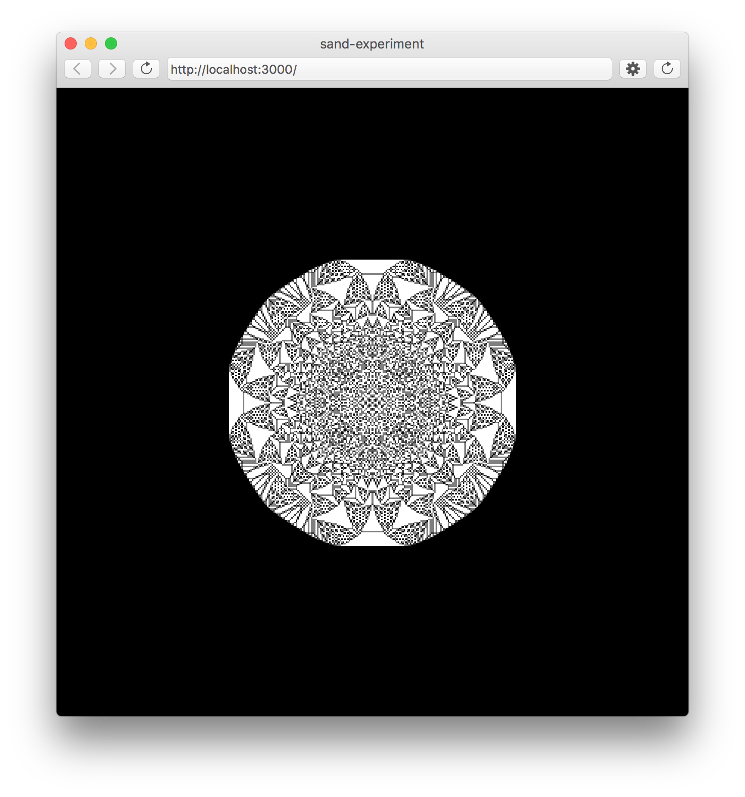
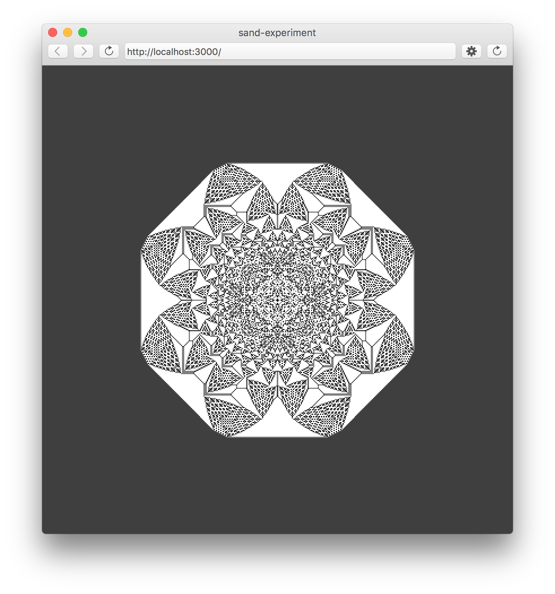
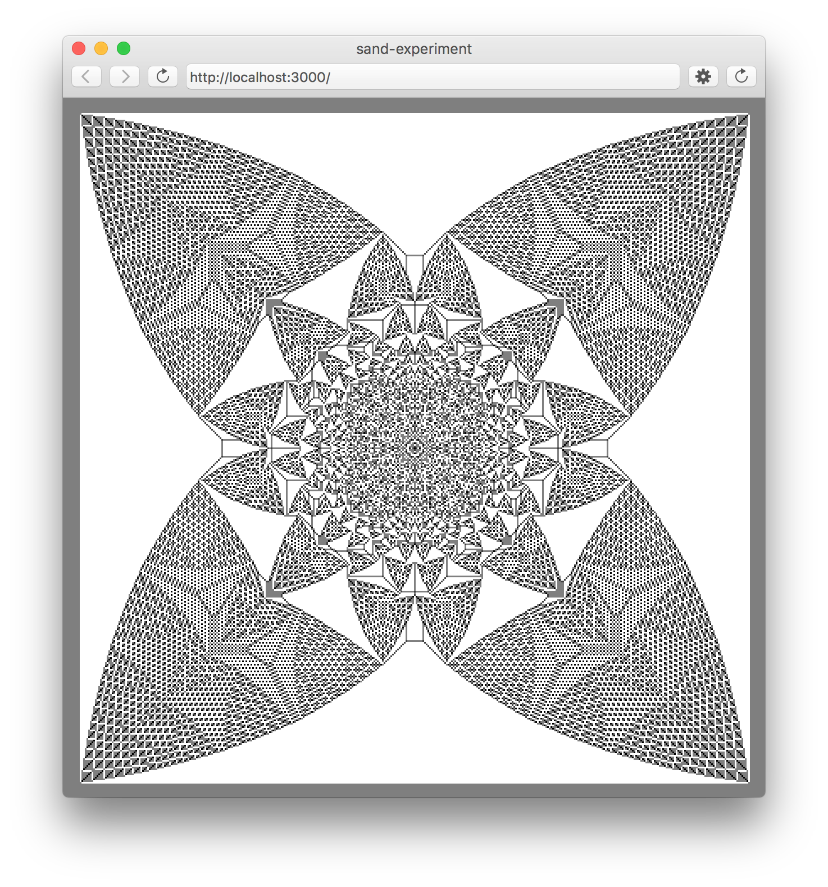

# ... but will it blend ???
## p5.js

*In this part, we are going to recap our newly acquired javascript knowledge
and create a cellular automaton in P5.js*

#### Game of Sand ####

In the **Abelian Sandpile Model** every square follows a simple rule:  
If there's more than 4 grains of sand on a cell, distribute 4 of them evenly among the neighbors in North, East, South and West direction (Van-Neumann-Neighborhood)

* [Game of Sand](../examples/p5js/sand-experiment)

###### Sand on the Empty Plane ######

###### Sand on a Plane filled with one Grain per Cell ######

###### Sand on a Plane filled with two Grains per Cell ######

#### Game of Sand as Shader

How would you implement the sand model on aprallel computer?

### Links

* Abelian Game of Sand